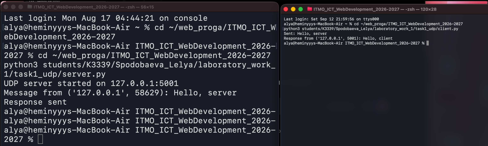
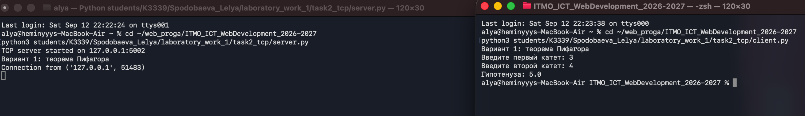
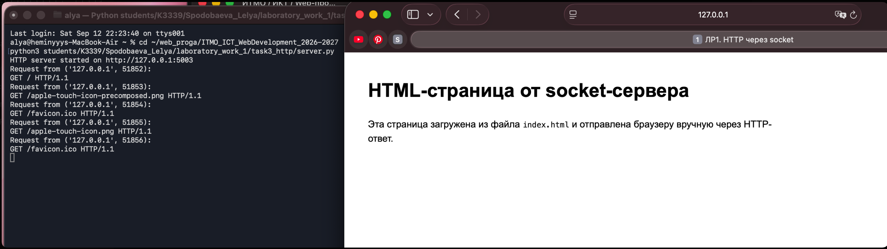
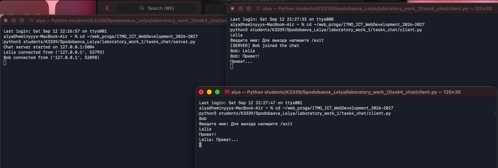
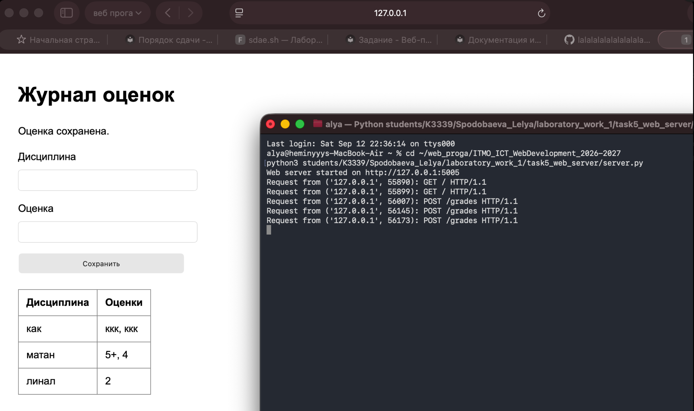

# Лабораторная работа 1. Сокеты

## Цель работы

Изучить принципы межсокетного взаимодействия и реализовать несколько клиент-серверных приложений на Python с использованием библиотеки `socket`.

## Структура файлов

Код лабораторной работы находится в папке:

```text
students/К3339/Spodobaeva_Lelya/laboratory_work_1/
```

Работу выполнила: Леля Сподобаева, группа К3339.

| Папка | Назначение |
|-------|------------|
| `task1_udp/` | UDP-клиент и UDP-сервер для обмена сообщениями |
| `task2_tcp/` | TCP-клиент и TCP-сервер для математических вычислений |
| `task3_http/` | HTTP-сервер, который отдаёт файл `index.html` |
| `task4_chat/` | Многопользовательский TCP-чат с потоками |
| `task5_web_server/` | Простой веб-сервер с обработкой GET и POST |

## Практическое задание 1. UDP

В первом задании реализован обмен сообщениями по UDP: `task1_udp/server.py` и `task1_udp/client.py`. Клиент отправляет серверу сообщение `Hello, server`, сервер выводит его в терминал и отправляет ответ `Hello, client`.

Запуск (сервер и клиент — в разных терминалах):

```bash
python3 task1_udp/server.py
python3 task1_udp/client.py
```

Результат:



```text
Sent: Hello, server
Response from ('127.0.0.1', 5001): Hello, client
```

## Практическое задание 2. TCP-вычисления

Во втором задании реализован вариант 1: вычисление гипотенузы по теореме Пифагора (`task2_tcp/`). TCP-сервер принимает JSON-запрос с двумя катетами, считает `c = sqrt(a^2 + b^2)` и возвращает результат клиенту.

```bash
python3 task2_tcp/server.py
python3 task2_tcp/client.py
```

Проверила на катетах 3 и 4 — гипотенуза 5.0, всё сошлось:



Формат обмена — обычный JSON:

```json
// запрос клиента
{"a": 3.0, "b": 4.0}

// ответ сервера
{"status": "ok", "result": {"c": 5.0}}
```

Если катет отрицательный или нулевой, сервер возвращает `{"status": "error", "message": "..."}` вместо падения — это проверила отдельно, вводом `-1`.

## Практическое задание 3. HTTP и HTML

Здесь сервер (`task3_http/server.py`) вручную собирает HTTP-ответ: статус `200 OK`, заголовки `Content-Type`, `Content-Length`, `Connection: close`, и тело — содержимое `task3_http/index.html`.

После запуска страница открывается в браузере по адресу `http://127.0.0.1:5003`.

```bash
python3 task3_http/server.py
```



Неожиданный момент: в логе видно, что браузер сам по себе шлёт ещё запросы на `/favicon.ico` и `/apple-touch-icon.png` — сервер их не различает и на любой путь просто отдаёт `index.html`, но по факту получилось, что страница всё равно открылась корректно.

## Практическое задание 4. Чат

Многопользовательский TCP-чат (`task4_chat/`): сервер принимает несколько подключений, на каждое создаёт отдельный поток (`threading`). При подключении спрашивает имя, выход — по команде `/exit`.

Проверяла с двумя клиентами одновременно, в трёх терминалах (сервер + 2 клиента):

```bash
python3 task4_chat/server.py
python3 task4_chat/client.py
```



```text
[SERVER] Bob joined the chat
Bob: Привет!
Lelia: Привет...
```

Сообщения одного клиента рассылаются всем остальным, кроме отправителя (`broadcast`), это видно по логу — сервер сам себе ничего не шлёт.

## Практическое задание 5. GET/POST веб-сервер

Простой веб-сервер на `socket` (`task5_web_server/server.py`), без каких-либо фреймворков, вручную разбирает HTTP-запросы:

| Метод | URL | Действие |
|-------|-----|----------|
| GET | `/` | HTML-страница с формой и таблицей оценок |
| POST | `/grades` | Сохраняет дисциплину и оценку в `grades.json` |

```bash
python3 task5_web_server/server.py
```

Открывается по `http://127.0.0.1:5005`. Заполнила форму несколько раз для разных дисциплин — сервер дописывает оценки в `grades.json`:



```json
{
  "как": ["ккк", "ккк"],
  "матан": ["5+", "4"],
  "линал": ["2"]
}
```

В логе видно, что GET-запросы просто открывают страницу, а каждое сохранение формы — это отдельный POST `/grades`; сервер обрабатывает запросы по очереди, в одном потоке, без каких-либо фреймворков.

## Вывод

Реализовала обмен по UDP и TCP, ручную сборку HTTP-ответов, многопользовательский чат на потоках и веб-сервер с обработкой формы.

Больше всего времени заняло задание 5 — там я сначала читала запрос одним `recv()`, как в задании 3, и POST с длинным телом обрезался, пока не разобралась, что нужно ориентироваться на `Content-Length` и дочитывать данные, пока тело не наберётся полностью. В чате (задание 4) не сразу учла, что при отключении клиента `sendall` может упасть с ошибкой — пришлось оборачивать рассылку в `try/except`, иначе падал весь поток при обрыве соединения одного из пользователей. В остальном сокеты оказались проще, чем ожидала — самое сложное было не в протоколах, а в мелочах вроде разбора сырых байтов запроса.
